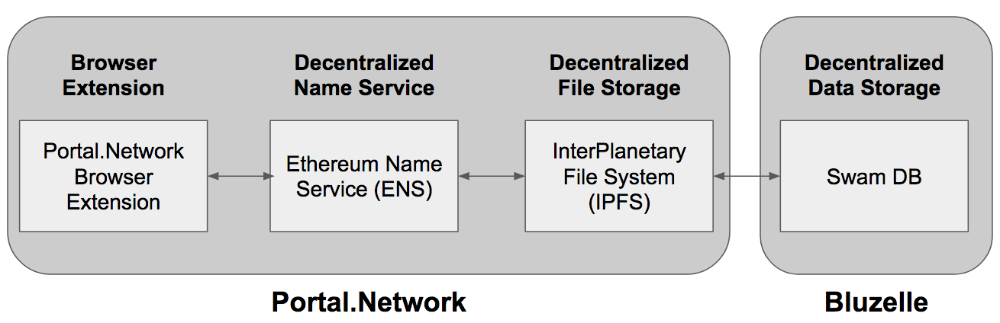

# Portal Network x Bluzelle


### Introduction

This is a demo project showing how users can easily create, update, read, and delete todo items to decentralized database (Bluzelle).

## Setup Bluzelle Swarm DB from Docker

Docker install guide: [BLUZELLE.md](./BLUZELLE.md).

## Architecture


## View Demo
Simple demo with this repo.


## Technical Stack

### Frontend
- react
- bluzelle.js

### UI
- bootstrap

### Swarm
- SwarmDB

## Setup

### Setup config environment

Open `.env` to setup environment parameters
```
export BLUZELLE_WEBSOCKET="ws://192.168.1.24:51010"
export BLUZELLE_UUID="71e2cd35-b606-41e6-bb08-f20de30df76c"
```

```
source .env
```

### Install node modules

```
npm install
```


### Start the server

```
npm run start
```
